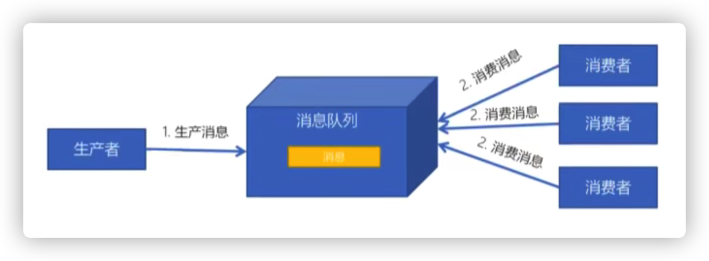

# Kafka

# 一、简介

## 1.1 何为Kafka

### 1.1.1 背景

### 1.1.2 适用场景

应用场景很多，不在本文讨论范围，主要分为以下四种场景

1. 异步处理
2. 系统解耦（不过主流的还是用RPC）
3. 流量削峰
4. 数据处理

具体介绍：略

### 1.1.3 与其它系统的对比

Kafka

ActiveMQ

RabbitMQ

RocketMQ

ZeroMQ

## 1.2 工作模式

消息队列通常都会跟生产者、消费者进行交互，生产者发送消息到队列中，消费者从队列取消息，这一过程根据不同的交互方式，分为一下两种模式。

### 1.2.1 点对点

生产者发送消息到队列，消费者从队列消费消息，消息被消费后，队列中的该消息对该消费者不在可见。点对点的特点：

- 每个消息只能有一个消费者
- 生产者和消费者之间没有依赖性，不管消费者有没有消费消息，都不影响生产者下一次继续生产消息发送到消息队列
- 消费者成功消费消息之后，需要向消息队列发送应答，以便于消息队列清理已被消费过的消息

### 1.2.2 发布订阅模式

- 每个消息可以有多个订阅者
- 发布者和订阅者有时间上的依赖性，针对某个主题，需要创建了订阅者之后才能收到订阅消息，创建订阅者前的消息不会再被订阅者收到
- 订阅者需要保持在线运行才能持续收到消息

# 二、开发

# 三、重要概念

# 四、进阶原理